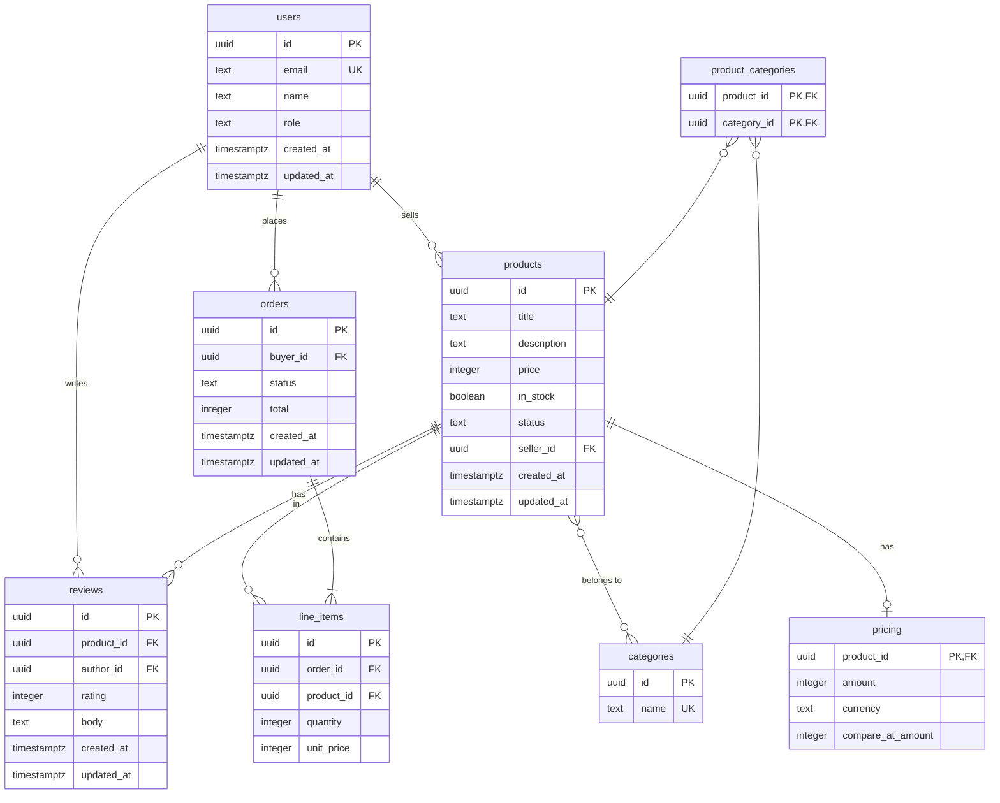

# Data Design & ERD

This document defines the database schema, entity relationships, and design decisions for the GraphQL Training curriculum.

---

## ERD (Mermaid)

---

## Table Definitions

### users

Introduced at stage 06 (users + reviews), expanded at stage 11 (auth).

| Column | Type | Constraints | Notes |
|--------|------|-------------|-------|
| id | UUID | PK, DEFAULT gen_random_uuid() | |
| email | TEXT | NOT NULL, UNIQUE | Validated as EmailAddress scalar in stage 15 |
| name | TEXT | NOT NULL | |
| role | TEXT | NOT NULL, DEFAULT 'CUSTOMER', CHECK (role IN ('CUSTOMER','SELLER','ADMIN')) | TEXT + CHECK, not Postgres ENUM |
| created_at | TIMESTAMPTZ | NOT NULL, DEFAULT now() | |
| updated_at | TIMESTAMPTZ | NOT NULL, DEFAULT now() | |

### products

Introduced at stage 02 (first DB tables). `seller_id` added at stage 12 (orders).

| Column | Type | Constraints | Notes |
|--------|------|-------------|-------|
| id | UUID | PK, DEFAULT gen_random_uuid() | |
| title | TEXT | NOT NULL | |
| description | TEXT | nullable | |
| price | INTEGER | NOT NULL | Cents. Replaced by `pricing` table at stage 15 but kept for backwards compat |
| in_stock | BOOLEAN | NOT NULL, DEFAULT true | |
| status | TEXT | NOT NULL, DEFAULT 'DRAFT', CHECK (status IN ('DRAFT','ACTIVE','ARCHIVED')) | |
| seller_id | UUID | FK -> users(id), nullable | Added at stage 12. Nullable for early stages |
| created_at | TIMESTAMPTZ | NOT NULL, DEFAULT now() | |
| updated_at | TIMESTAMPTZ | NOT NULL, DEFAULT now() | |

### categories

Introduced at stage 02 (alongside products).

| Column | Type | Constraints | Notes |
|--------|------|-------------|-------|
| id | UUID | PK, DEFAULT gen_random_uuid() | |
| name | TEXT | NOT NULL, UNIQUE | |

### product_categories

Join table for M:N relationship. Introduced at stage 02.

| Column | Type | Constraints | Notes |
|--------|------|-------------|-------|
| product_id | UUID | PK, FK -> products(id) ON DELETE CASCADE | |
| category_id | UUID | PK, FK -> categories(id) ON DELETE CASCADE | |

### reviews

Introduced at stage 06 (users + reviews). One review per user per product.

| Column | Type | Constraints | Notes |
|--------|------|-------------|-------|
| id | UUID | PK, DEFAULT gen_random_uuid() | |
| product_id | UUID | NOT NULL, FK -> products(id) ON DELETE CASCADE | |
| author_id | UUID | NOT NULL, FK -> users(id) | |
| rating | INTEGER | NOT NULL, CHECK (rating BETWEEN 1 AND 5) | |
| body | TEXT | nullable | |
| created_at | TIMESTAMPTZ | NOT NULL, DEFAULT now() | |
| updated_at | TIMESTAMPTZ | NOT NULL, DEFAULT now() | |
| | | UNIQUE (product_id, author_id) | |

### orders

Introduced at stage 12 (orders).

| Column | Type | Constraints | Notes |
|--------|------|-------------|-------|
| id | UUID | PK, DEFAULT gen_random_uuid() | |
| buyer_id | UUID | NOT NULL, FK -> users(id) | |
| status | TEXT | NOT NULL, DEFAULT 'PENDING', CHECK (status IN ('PENDING','CONFIRMED','SHIPPED','DELIVERED','CANCELLED')) | |
| total | INTEGER | NOT NULL | Cents |
| created_at | TIMESTAMPTZ | NOT NULL, DEFAULT now() | |
| updated_at | TIMESTAMPTZ | NOT NULL, DEFAULT now() | |

### line_items

Introduced at stage 12 (orders). Belongs to an order, references a product.

| Column | Type | Constraints | Notes |
|--------|------|-------------|-------|
| id | UUID | PK, DEFAULT gen_random_uuid() | |
| order_id | UUID | NOT NULL, FK -> orders(id) ON DELETE CASCADE | |
| product_id | UUID | NOT NULL, FK -> products(id) | No CASCADE — don't lose order history if product is deleted |
| quantity | INTEGER | NOT NULL, CHECK (quantity > 0) | |
| unit_price | INTEGER | NOT NULL | Cents. Snapshot at order time, not a live reference to product price |

### pricing

Introduced at stage 15 (schema evolution). Replaces flat `products.price` field.

| Column | Type | Constraints | Notes |
|--------|------|-------------|-------|
| product_id | UUID | PK, FK -> products(id) ON DELETE CASCADE | 1:1 with products |
| amount | INTEGER | NOT NULL | Cents |
| currency | TEXT | NOT NULL, DEFAULT 'USD' | |
| compare_at_amount | INTEGER | nullable | "Compare at" / original price for sales |

---

## Indexes

Beyond primary keys and unique constraints, these indexes support the curriculum's query patterns:

| Index | Table | Columns | Stage | Purpose |
|-------|-------|---------|-------|---------|
| idx_products_status | products | status | 02 | Filter by product status |
| idx_products_seller_id | products | seller_id | 12 | Seller's product listing |
| idx_products_created_at | products | created_at | 09 | Cursor pagination ordering |
| idx_products_price | products | price | 09 | Price range filtering with pagination |
| idx_reviews_product_id | reviews | product_id | 06 | DataLoader batch loading |
| idx_reviews_author_id | reviews | author_id | 06 | User's reviews |
| idx_orders_buyer_id | orders | buyer_id | 12 | User's order history |
| idx_orders_status | orders | status | 13 | Subscription filtering |
| idx_line_items_order_id | line_items | order_id | 12 | Order -> items lookup |
| idx_line_items_product_id | line_items | product_id | 12 | Product purchase history |

---

## Design Decisions

### Money as INTEGER (cents), not FLOAT or NUMERIC

Floats have rounding errors (`0.1 + 0.2 !== 0.3`). Storing cents as integers is exact and what Stripe and every payment system uses. The GraphQL `Money` custom scalar (stage 15) handles display formatting. `NUMERIC`/`DECIMAL` is also correct but integers are simpler across all languages.

### Enums as TEXT + CHECK, not Postgres ENUM

Postgres `CREATE TYPE ... AS ENUM` is painful to alter — you can add values but cannot remove or rename without recreation. `TEXT + CHECK` constraints are:
- Easy to migrate (update the CHECK constraint)
- Portable across databases (SQLite, MySQL, Postgres)
- Still enforced at the DB level

### UUIDs, not serial integers

The GraphQL schema uses `ID!` everywhere and the curriculum teaches global object identification (stage 07 `node(id: ID!)`). UUIDs:
- Work naturally as global IDs without encoding schemes like `Product:123`
- Are safe to expose publicly (no enumeration attacks)
- Work across federated subgraphs (stage 16) without collision
- `gen_random_uuid()` is built into Postgres 13+; for SQLite, generated in application code or via extension

### SQLite as the default database

SQLite is a file — zero infrastructure, no Docker, no server process. Every language has bindings. This keeps the curriculum focused on GraphQL, not database administration. The schema is written to be portable; students can use Postgres if they prefer.

### Timestamps from the start

`created_at`/`updated_at` columns exist from migration 1, even though the `Timestamped` interface isn't exposed until stage 07. Adding them retroactively via ALTER TABLE is messy. Better to have them and not expose them in early GraphQL schemas.

### unit_price snapshot on line_items

`line_items.unit_price` captures the price at order time. Products change price; historical orders should not retroactively change totals.

### Hard deletes, no soft delete

`ON DELETE CASCADE` where appropriate. This is a training project — simplicity wins. The curriculum does not cover soft delete patterns. Adding `deleted_at` everywhere would be noise.

---

## What lives outside the database

| Concern | Where | Why |
|---------|-------|-----|
| Auth tokens / sessions | JWT in middleware | Stateless auth, no DB table needed |
| Subscription state | In-memory pub/sub (or Redis) | Not relational data |
| Shipping estimates | External API (stage 14) | Fetched on demand, optionally cached |
| Query depth / complexity limits | Server config | Not data |
| DataLoader cache | Per-request in-memory | Scoped to single request lifecycle |

---

## Stage-to-Table Introduction Map

| Stage | Tables Introduced | Tables Modified | Seed Data |
|-------|-------------------|-----------------|-----------|
| 01 | (no database) | | None |
| 02-05 | products, categories, product_categories | | base.sql |
| 06 | users, reviews | | full.sql (scaled) |
| 09 | | products (pagination indexes) | Same |
| 12 | orders, line_items | products (add seller_id) | + orders in full_with_orders.sql |
| 15 | pricing | | + pricing records |
